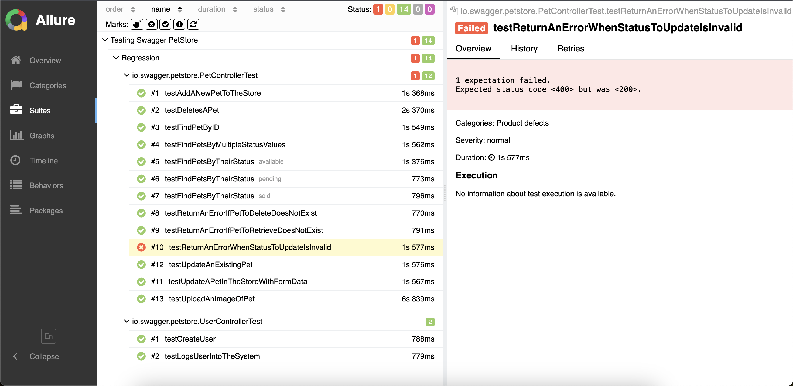

# API Test Automation with Rest Assured - Java

This is an automation project for the Swagger PetStore API (OAS 2.0 - [Swagger JSON](https://petstore.swagger.io/v2/swagger.json)) using Rest Assured with Java.

The project follows a clean and maintainable architecture, considering that APIs tend to grow over time.

## Dependencies

The following dependencies are used in this project:

- TestNG
- Rest Assured
- Lombok
- Hamcrest
- Allure
- And more (see the full list in the `pom.xml` file).

## Reporting

Allure is integrated for test reporting.

## Run tests and generate report
- Run tests > `mvn clean test`
- Generate the Allure report > `mvn allure:report`
- View the report in your browser > `allure serve target/allure-results`

## Notes

- This project focuses on a clean and maintainable approach to API test automation rather than achieving full test coverage.
- It does not cover all happy paths and edge cases.
- Some happy path test cases may fail occasionally due to API issues (which are actual bugs that need to be fixed). These failures do not indicate flaky tests.
- Future maintenance may be required as the API evolves.
